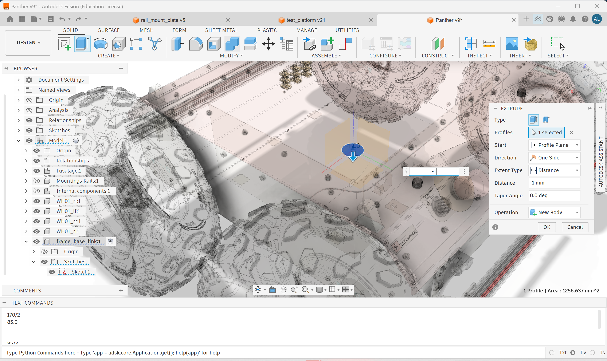
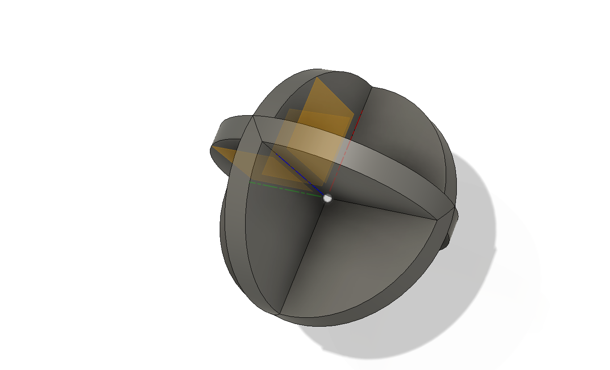
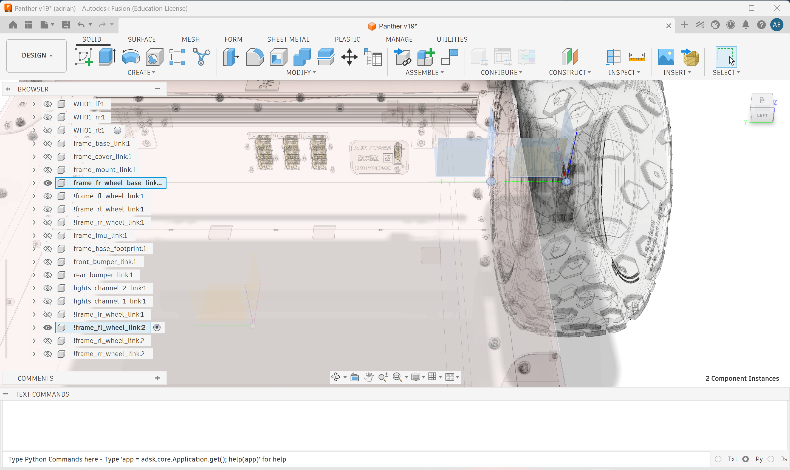
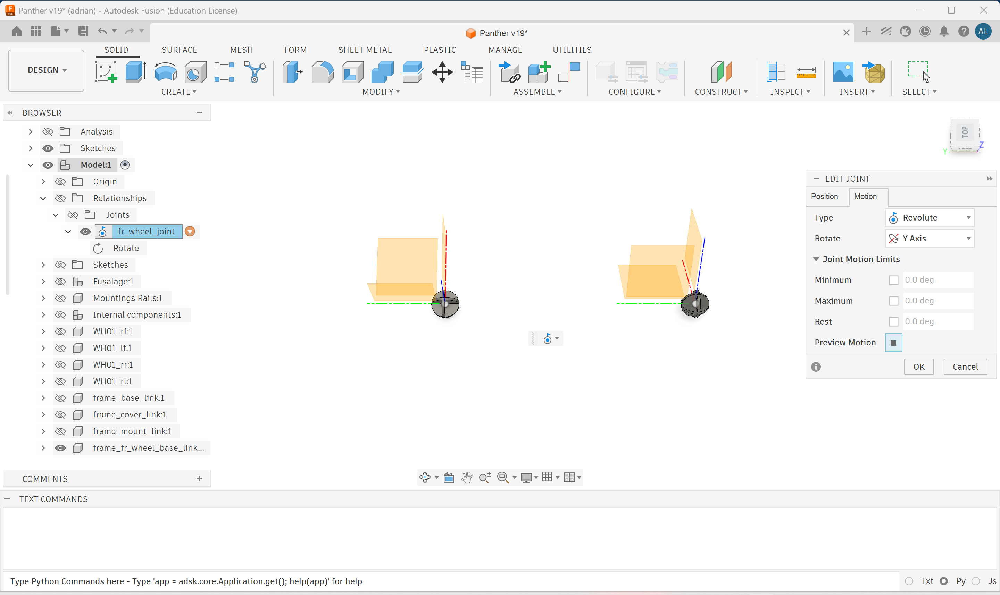
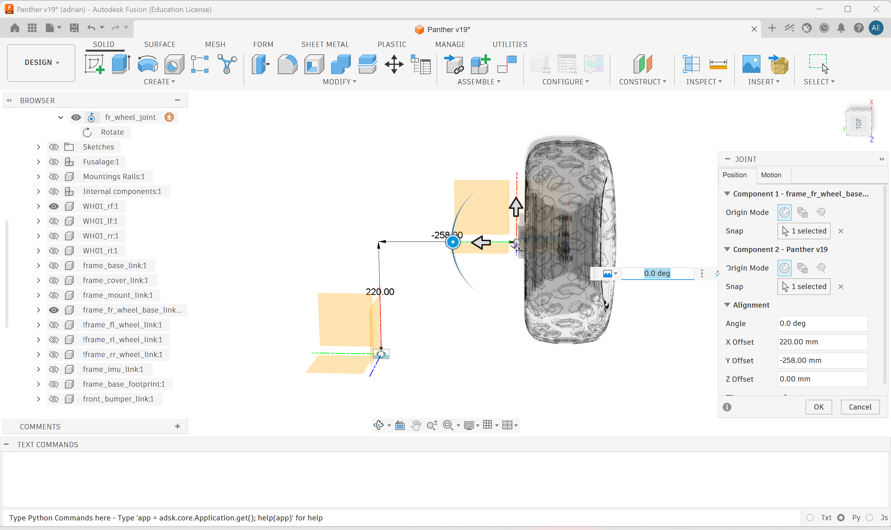
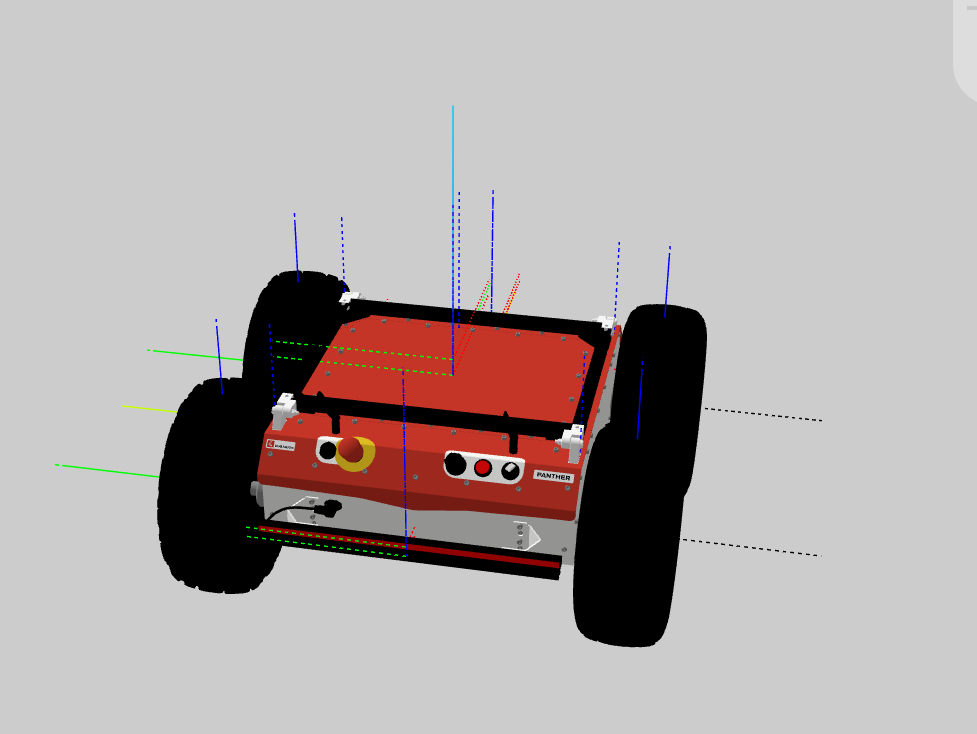
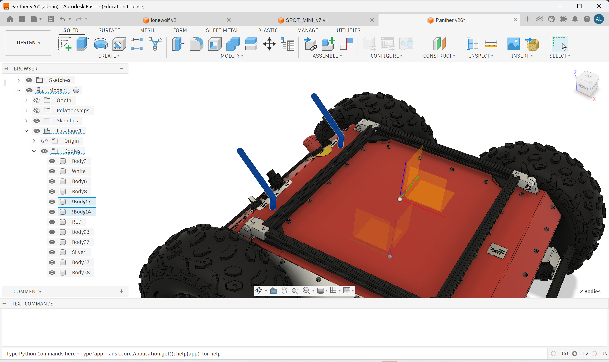
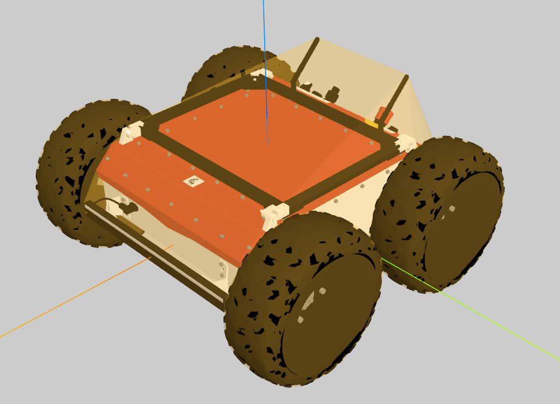
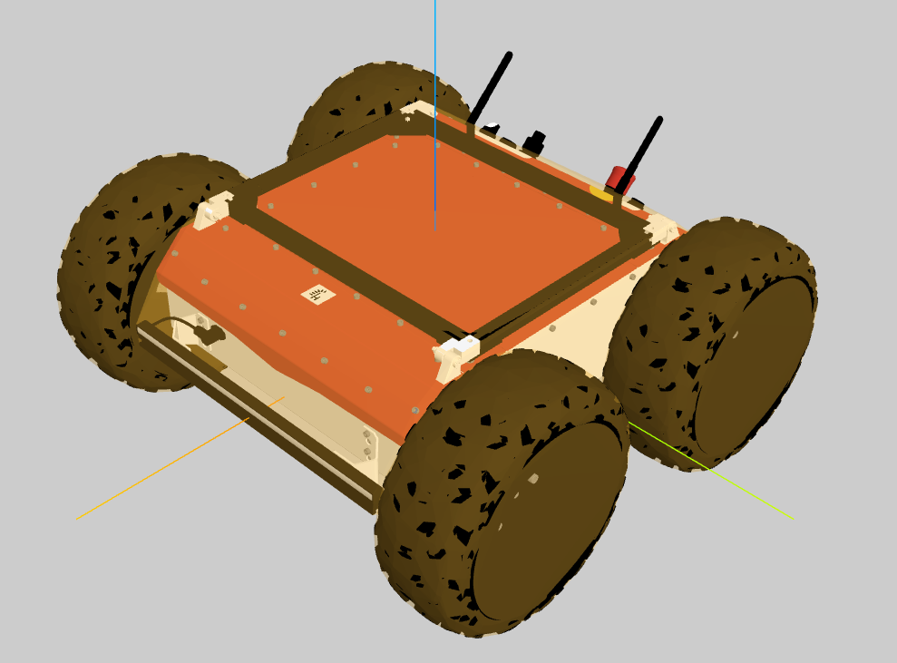

# Design Guide

This guide describes the recommended way to build Fusion 360 robot
models for the URDF/Xacro exporter.

Use this document for practical modelling advice. Use
[DESIGN_RULES.md](DESIGN_RULES.md) as the compact reference for exact
export conventions, reserved prefixes, and hard requirements.
For remaining tradeoffs, see [Limitations](docs/LIMITATIONS.md).

## The Short Version

For clean new robot designs:

1. Model in ROS orientation: `Z` up, `X` forward, `Y` left.
2. Create one Fusion component for each simple moving link, and keep
   geometry visible unless you intentionally want it omitted from the
   exported mesh.
3. Use a Fusion `Rigid Group` when several components should become one
   rigid URDF link.
4. Put joints between links, not inside rigid groups.
5. Prefer regular Fusion joints for mechanisms, because they let you
   control the joint origin and axis.
6. Use `!frame_*` helper components when a link frame must be explicit.
   Inside a rigid group, the helper becomes the merged link frame and
   its geometry is not exported.
7. Use a top-level assembly file to bring links and subassemblies
   together.
8. Do a minimal-mode export early and read the warning dialog. The
   exporter writes `debug/extraction_report.md` with the kinematic
   tree and any issues it noticed; fix Fusion side first, mesh export
   later.
9. Use reserved metadata tags only when you mean them. Prefer the
   explicit `!` form: `!collision_*`, `!acc_*`, `!cxh_*`, `!pri_*`,
   `!frame_*`, `!dummy_*`, `!passive_*`, and `!closing_*`.
10. Leave generated ros2_control enabled when you want an immediate ROS 2
    bringup. Mark unpowered movable joints with `!passive_*` so they are
    published as state only.

The exporter can handle messier imported CAD, including loose root
bodies, but deliberate Fusion structure gives cleaner URDF, cleaner
xacro, and fewer surprises downstream.

> Large exports can take a while. Keep Fusion responsive and wait for
> the export status to finish before assuming it has crashed.

## Mental Model

Think in URDF terms while modelling in Fusion:

| URDF concept | Fusion modelling pattern |
| --- | --- |
| Link | One component, or one `Rigid Group` of components |
| Joint | Fusion joint between two links |
| Robot tree | Connected Fusion joint graph with one root |
| Closed loop | Valid URDF tree plus `!closing_*` sidecar joint |
| Visual mesh | Normal bodies/components |
| Collision mesh | `!collision_*` body/component, primitive, convex hull, or `!acc_*` exact mesh |
| Explicit link frame | `!frame_*` component, standalone or inside a `Rigid Group` |
| Swappable placeholder | `!dummy_*` assembly |

If something should move relative to something else, it must be a
separate component or rigid group. Fusion will not let you create a real
joint between two bodies that live inside the same rigid part.

## Recommended Assembly Layout

The cleanest pattern is a dedicated top-level assembly that only brings
links and subassemblies together.

Example:

```text
spot_like_robot/
  base_link
  front_left_leg/
    hip_link
    knee_link
    foot_link
  front_right_leg/
    hip_link
    knee_link
    foot_link
  camera_module/
    camera_link
```

The top-level file is where you attach the major subsystems. Each
subassembly can still contain internal links and joints.

This makes it easier to:

- swap a leg, tool, or sensor module
- keep mesh folders readable
- understand where cross-assembly mount joints belong
- debug the kinematic tree
- regenerate only the parts you changed

Ad-hoc single-file designs are supported, and downloaded CAD often comes
that way. For new work, a dedicated assembly file is usually easier to
maintain.

## Links

### Visibility

Fusion visibility is respected by mesh export. Hidden bodies and hidden
occurrences are not written to the visual mesh, and generated collision
based on the visual mesh will not include them either.

Use this for construction geometry or alternatives you do not want in
the robot description. Do not use visibility as the only way to remove a
physical part from the model; check mass and inertia if the body still
exists in Fusion.

### Single-Component Link

Use this when one Fusion component is one physical moving link.

```text
base_link
  body_1
  body_2
```

Result:

- one URDF link named `base_link`
- visual mesh from the component bodies
- mass and inertia from Fusion physical properties
- collision from explicit geometry, primitive fitting, or visual fallback

### Multi-Component Link

Use a Fusion `Rigid Group` when several components should behave as one
rigid body.

Example:

```text
sensor_module/
  sensor_body
  sensor_cap
  sensor_pcb
  !collision_sensor
```

Rigid group:

```text
Rigid Group "sensor_link" =
  sensor_body
  sensor_cap
  sensor_pcb
  !collision_sensor
```

Result:

- one URDF link named `sensor_link`
- one merged visual mesh
- one collision mesh
- summed mass
- combined center of mass and inertia

Do not put joints inside this rigid group. If two parts need a joint
between them, they are not one rigid link.

Fasteners are the normal exception to think about, but not to model as
separate links. Put screws, nuts, washers, and Fusion's fastener-folder
hardware in the rigid group for the part they are mounted to. Fusion may
create internal rigid joints for those fasteners; the exporter drops
those redundant rigid joints and keeps the hardware as part of the
merged link.

### Explicit Link Frames With `!frame_*`

Use a small helper component named `!frame_<link_name>` when the Fusion
component origin is not the URDF frame you want. Put that helper in the
same rigid group as the physical parts.

You do not need frame helpers when the component origin, joint origin,
and joint axis are already designed correctly. They exist for two cases:
first, to make a difficult Fusion coordinate system explicit when the
geometry is good but the origin or orientation is not; second, to create
real virtual/reference links such as IMU frames, camera optical frames,
tool points, or DH-style coordinate systems that may sit outside the
visible robot body.

For a rigid group, the `!frame_*` member becomes the merged link frame.
Its body is ignored for visual mesh, collision, mass, and inertia. The
physical members still provide all exported geometry and physical
properties.

This is useful for chassis origins, wheel centers, mount frames, sensor
frames, and tool center points. Use one frame marker per rigid group, and
prefer matching the stripped frame name to the rigid group or exported
link name.

The helper body shape is only for Fusion visibility. A thin disc works
for base frames; a small sphere or disc stack can make wheel and hinge
axes easier to inspect. The helper geometry is ignored when the
component is tagged `!frame_*`.

| Base-frame marker | Axis marker |
| --- | --- |
|  |  |

Wheel links are a good example: add the wheel mesh and a
`!frame_fl_wheel_link` helper to the same rigid group, then place the
joint at that helper. The exported wheel mesh keeps its baked offset, but
the URDF link and joint frame are centered on the wheel axis.



Check the axis before exporting. For the usual ROS convention, the wheel
can rotate around local `Y` while local `Z` points up.



If Fusion picks the wrong reference direction, select a custom axis and
check it with the right-hand rule before export.



After export, the helper geometry is gone but the frames remain.



### Subassembly as a Link

A subassembly can become one link if it is connected to the rest of the
robot using an as-built joint. This is supported mainly for imported or
imported designs.

For new designs, prefer a `Rigid Group` to say explicitly: "these
components are one rigid body."

## Joints

Use regular Fusion joints when the joint frame matters.

Good cases for regular joints:

- revolute axes
- slider axes
- off-center pivots
- sensor frames
- tool center points
- any joint that must be inspected or controlled downstream

Use as-built joints only when the exact joint origin is not important,
or when you intentionally connect an already-positioned subassembly as a
single link.

### Parent and Child Direction

Fusion stores a joint with two sides:

- `occurrenceOne`: child or moving side
- `occurrenceTwo`: parent or static side

This matters because the exporter builds the URDF tree from that
direction. If the joint is flipped, the exported robot can get an
unexpected root, unreachable links, or a reversed TF tree.

A minimal-mode export is fast and surfaces these issues in the warning
dialog and `debug/extraction_report.md` before you spend mesh-export
time. It is much faster to fix joint direction in Fusion than to debug
a bad URDF later.

## Tree Topology and Loops

URDF is a tree format. Each exported link can have only one parent joint.

Good tree:

```text
base_link -> shoulder_link -> elbow_link -> wrist_link
```

Closed-loop mechanisms, such as four-bars or parallel grippers, are not
directly representable in URDF. The exporter handles them by keeping a
valid URDF tree and writing the loop-closing joint to `robot_data.yaml`.

Recommended pattern:

```text
base_link -> left_slider -> gripper_tip
base_link -> right_slider -> gripper_tip
```

Tag the joint that should close the loop:

```text
!closing_right_slider_joint
```

Result:

- URDF stays valid
- loop-closing joint is omitted from the URDF tree
- joint metadata is stored in `robot_data.yaml`
- downstream tools can rebuild the physical loop

If you do not tag the loop, the exporter tries to auto-detect it. That
works, but explicit `!closing_*` names make your intent clear.

## Naming

Names in Fusion become names in URDF, xacro, mesh folders, launch files,
and metadata. Name things as if they will be shown to a future user,
because they will.

Prefer:

```text
base_link
left_hip_link
left_knee_joint
camera_mount
sensor_link
```

Avoid:

```text
Component7
Rigid Group 3
test
main
final_version
copy of copy
```

Keep assembly names clean too. Assembly names become mesh subfolders and
xacro macro names. Avoid names that differ only by case, such as
`Panther` and `panther`; they collide on Windows and are confusing on
Linux. Empty wrapper assemblies are ignored by the exporter, so use
assemblies for structure without worrying that every folder becomes a
xacro file.

## Collision Strategy

Most robots should use simple collision for most links. Exact visual mesh
collision is expensive and often makes simulation less stable.

Use this order of preference:

1. Let the exporter auto-fit primitive collision.
2. Try `collision_method = "convex_hull"` for imported or angled CAD
   where a primitive box/cylinder is too rough but exact visual collision
   is too heavy.
3. Add simple `!collision_*` geometry where automatic fitting is not good
   enough.
4. Use `!cxh_*`, `!pri_*`, or `!acc_*` on individual links when the
   global collision method is right for most of the robot but wrong for
   one part.

### Auto Primitive Collision

This is usually good for beams, boxes, cylinders, plates, wheels, and
many imported CAD shapes. It keeps simulation cheaper.

### Convex Hull Collision

Convex hull collision is selected in `xacro_export.toml`:

```toml
[mesh]
collision_method = "convex_hull"
```

It generates one convex STL per link from the exported visual OBJ
vertices. This is useful for diagonal beams, tapered shapes, and
downloaded CAD where a primitive is visibly wrong, while still avoiding
the cost of full visual mesh collision.

### Custom Collision Geometry

If primitive collision is too rough, model a simplified collision shape
and mark it with `!collision_*`.

Example:

```text
forearm_assembly/
  forearm_shell
  forearm_motor_cover
  !collision_forearm
```

Rigid group:

```text
Rigid Group "forearm_link" =
  forearm_shell
  forearm_motor_cover
  !collision_forearm
```

The collision member is excluded from visual output and used as the
collision STL for the merged link.

### Accurate Collision

Use `!acc_*` when the visual mesh shape matters for contact:

- gripper fingers
- tool tips
- mating surfaces
- small contact geometry where primitive collision is misleading

Example:

```text
!acc_gripper_finger
```

The prefix is stripped from the exported link name, and the visual mesh
is reused as collision for that link.

Do not use `!acc_*` everywhere. It can make simulation slow.

Use per-link overrides when one link should differ from the global
`collision_method`:

```text
!cxh_panther_body     # force convex hull for this link
!pri_wheel_guard      # force primitive collision for this link
!acc_gripper_finger   # force exact visual mesh collision for this link
```

The exporter strips the metadata keyword from the exported link name.

### Visual-Only Bodies

If a small visual detail makes generated collision too large, prefix the
body name with `!`. This is for body names, not component names.

Example:

```text
!antenna
!button_cap
```

The body stays in the visual mesh, but generated primitive, convex-hull,
and exact collision input ignores it. Use this for antennas, cables,
handles, zip ties, and other details that should be seen but not drive
the collision shape. If every body on a link is excluded this way, the
link exports with visual geometry but no collision element. This is a
body-level convention; component-level `!collision_*`, `!frame_*`,
`!cxh_*`, and similar tags keep their normal metadata meaning.

In Fusion, rename the detail bodies themselves:



For convex hull collision this keeps the hull from wrapping antennas,
buttons, or other small protrusions:

| Before body-level `!` exclusions | After body-level `!` exclusions |
| --- | --- |
|  |  |

## Placeholder and Optional Modules

Use `!dummy_*` for assemblies that are included only as placeholders.

Example:

```text
!dummy_camera/
  camera_body
  camera_mount
```

Result:

- visible in the URDF
- useful in RViz
- excluded from `robot_data.yaml`
- documented as swappable

This is useful when the robot should export as a complete visual model,
but a downstream pipeline will replace the placeholder with a real
sensor, tool, or payload.

## Generated ROS 2 Control

By default, package export adds a generic ros2_control layer for every
movable URDF joint (`revolute`, `continuous`, and `prismatic`). Fixed
and loop-closing joints are not controlled.

Generated packages include:

- `<ros2_control>` blocks in the flat URDF and owning assembly xacro
  macros
- `config/ros2_controllers.yaml`
- `joint_state_broadcaster` for joint state publishing
- forward command controllers for each configured command interface

In hierarchical xacro, movable joints that live inside `panther` are
controlled by the `panther_system` block, turret joints by
`turret_system`, and cross-assembly movable joints by the top-level
system. Controller topics are still normal ros2_control topics:
`/joint_states` for state and `/<controller_name>/commands` for command
arrays.

The default hardware plugin is `mock_components/GenericSystem`, which
lets `ros2_control_node` start without custom drivers. Replace the
plugin when integrating real hardware.

```toml
[features]
include_ros2_control = true

[ros2_control]
hardware_plugin = "mock_components/GenericSystem"
update_rate = 100
command_interfaces = "position,velocity"
```

Movable joints tagged `!passive_*` stay in the ros2_control state list
but do not receive command interfaces or command controllers. Use this
for springs, caster pivots, unpowered hinges, or mechanisms that should
be observed but not driven.

With the generated launch file, commands are published as arrays:

```bash
ros2 topic pub /position_controller/commands std_msgs/msg/Float64MultiArray "data: [0.0, 0.0]"
ros2 topic pub /velocity_controller/commands std_msgs/msg/Float64MultiArray "data: [0.0, 0.0]"
```

## Imported CAD

Downloaded models are rarely clean. The exporter supports several common
cases so you do not have to remodel everything:

- chassis bodies directly under the design root can become `base_link`
- empty helper components can be ignored when unreferenced
- duplicate names are made URDF-safe
- downloaded visual geometry can still get primitive collision

Still inspect imported models carefully:

- remove or ignore irrelevant helper geometry
- check that every real moving link has a joint
- check joint parent/child direction
- rename important components and joints
- add rigid groups where multiple components should be one link
- add `!collision_*` geometry only where needed

The goal is not perfect Fusion purity. The goal is a model whose
kinematic intent is visible to the exporter.

## Practical Workflow

Use this loop while modelling:

1. Create or import components.
2. Group multi-component rigid links with `Rigid Group`.
3. Add `!frame_*` helpers where a link or joint frame must be explicit.
4. Add regular joints between links.
5. Name components, rigid groups, joints, and assemblies.
6. Add simple `!collision_*` geometry only where needed.
7. Mark intentional closed loops with `!closing_*`.
8. Mark unpowered movable joints with `!passive_*` if using generated
   ros2_control.
9. Do a minimal-mode export to surface warnings cheaply.
10. Fix warnings while the model is still easy to change.
11. Run a full export with `fusion2URDF`.
12. Inspect the generated URDF in VS Code, RViz, Gazebo, or Isaac Sim.

## Common Problems

| Symptom | Likely cause | Fix |
| --- | --- | --- |
| Link appears at world origin | Link is orphaned | Add a joint or put it in a connected rigid group |
| Robot root is surprising | Joint direction is flipped | Check `occurrenceOne`/`occurrenceTwo` in Fusion |
| Visual part missing | It was tagged `!collision_*` | Rename it unless it is meant as collision |
| Rigid group exports oddly | Internal joint inside the group | Move the joint between links |
| Link frame is wrong | Component origin is not the desired URDF frame | Add a `!frame_*` helper to the rigid group |
| Collision is too large | Primitive fit is too rough | Add simplified `!collision_*` geometry |
| Simulation is slow | Too much exact mesh collision | Use primitives except where `!acc_*` is needed |
| Closed loop warning | Link has multiple parents | Tag the intended loop-closing joint with `!closing_*` |
| Generated controller drives the wrong joint | Joint should be unpowered | Rename the Fusion joint to `!passive_<name>` |

## Final Recommendation

Clean modelling pays off, but the exporter is intentionally practical.
Use components and rigid groups to show link structure, regular joints
to show motion, and prefixes to show special export intent. Then let a
minimal-mode export and its warning dialog tell you what the exporter
will see, before you spend time on a full mesh export.

