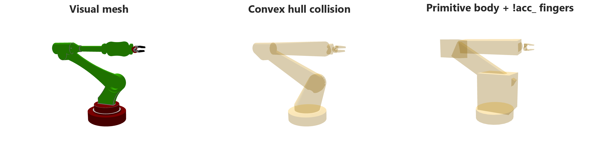
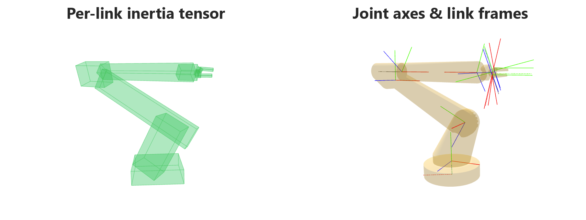
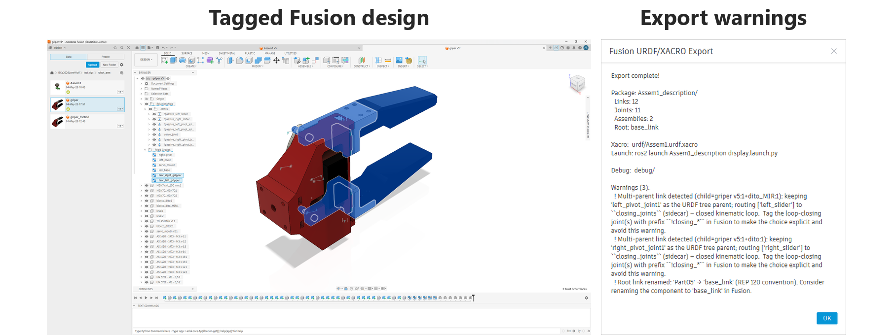
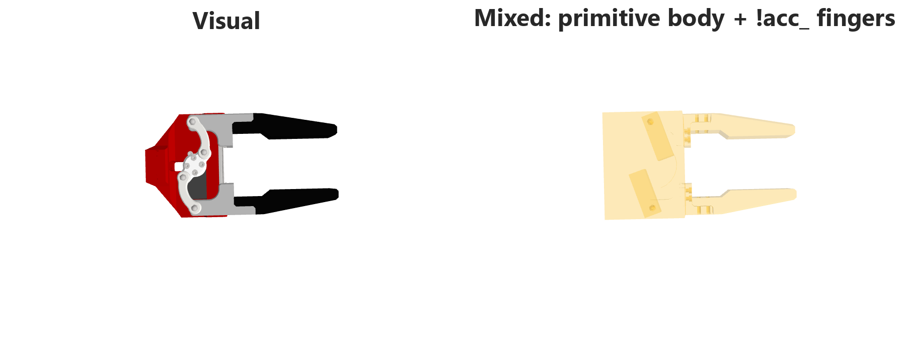

# fusion2URDF

[](https://github.com/Adriaeik/fusion2URDF/actions/workflows/test.yml)
[](LICENSE)
[](https://www.python.org/)
[](https://docs.ros.org/en/jazzy/)
[](https://www.autodesk.com/products/fusion-360/)

**Fusion 360 to ROS 2.** Export any Fusion 360 robot assembly to a complete `robot_description` package: hierarchical xacro with modular per-assembly macros, plus a flat URDF for those who prefer it, visual and collision meshes, inertia and mass preserved straight from Fusion, `ros2_control`, launch files, full KaTeX transform matrices, a `robot_data.yaml` for downstream tooling, and a cute screenshot of your robot (if you made it cute, I may add).

The whole thing is built on one idea: the exporter shall adapt to **your design style**, not the other way around. I've tested it on five distinct design styles, from a single flat component up to nested assemblies five layers deep where joints live inside sub-sub-sub assemblies and bind to that subassembly. It also tries to fix your mistakes: provides a `base_link` when one is missing, renames an unhelpful root, and surfaces topology problems in the warning dialog before mesh export burns time.

If your design style breaks it, please file an issue describing how. I don't think it will (jk, it probably will). And of course, all of the above is configurable through `xacro_export.toml`.


> Here is the Husarion Panther exported with fusion2URDF, viewed in RViz. Every link, joint, mesh, frame, and `ros2_control` block was generated automatically from the Fusion design.

## What you get out of one click

A full export of a 6-DoF arm and parallel gripper, straight from Fusion. Same model, three collision strategies: visual mesh, convex-hull collision, and a per-link mix where the body uses cheap auto-fitted primitives and the gripper fingers are tagged `!acc_*` to keep their exact contact geometry. All from the same Fusion design, no remodelling between exports.



The exporter writes the full inertia tensor at the centre of mass for every link, and joint axes resolved against each link's own frame. Origins, axis vectors, and limits are preserved through the rigid-group flattening and bake-offset shifts (which is harder than it sounds, and is the place where most CAD-to-URDF tooling silently produces nonsense). Below: per-link inertial boxes (what your physics solver actually sees), and the same arm with the exported joint axes and link frames drawn on top.



## Closed-loop kinematics, without faking it

URDF is a tree. Trees don't have cycles. Parallel-jaw grippers, four-bar linkages, and Stewart platforms have cycles. You see the problem.

Most Fusion-to-URDF tools either silently break or refuse to export. fusion2URDF detects the loop, exports a valid URDF tree, and stashes the loop-closing joint in `robot_data.yaml` for whatever downstream tool actually understands cycles. The same Fusion design also tags the four-bar follower joints `!passive_*` (so no command interface is generated for them) and the gripper fingers `!acc_*` (so they keep their exact contact mesh). Both are reflected in the export warnings:



Reconnect the sidecar joint downstream (Isaac Sim, MuJoCo, a custom physics pipeline) and the loop closes physically. Below: the bundled `Assem1` four-bar gripper running in Isaac Sim with the closing joint re-applied as a `UsdPhysicsPrismaticJoint`.

<p align="center">
  <video src="docs/video/Griper_in_isaacsim.mp4" controls width="640" muted></video>
  <br><em>If your viewer doesn't render the video inline: <a href="docs/video/Griper_in_isaacsim.mp4">docs/video/Griper_in_isaacsim.mp4</a></em>
</p>

Tag the loop-closing joint with `!closing_*` in Fusion to make the choice explicit. The exporter auto-detects untagged loops as a fallback, but the Fusion warnings are friendlier when you've labelled them.

## Inline `!`-tags

Inline `!`-tags let you tune the export without leaving Fusion. Drop a prefix on a component, rigid group, joint, or body name and the exporter picks it up at extraction time.

**Collision strategy per link.** The global `collision_method` sets the default; override it on individual links by tagging the component or rigid group:

- `!acc_*` uses the visual mesh as collision (accurate, expensive)
- `!cxh_*` forces a convex hull
- `!pri_*` forces an auto-fitted primitive (box, cylinder, or sphere)

The exporter strips the prefix from the URDF name, so `!acc_left_gripper` exports as `left_gripper`.

Below: gripper hand visual, then the same hand with auto-primitive collision on the body and `!acc_*` accurate visual-mesh collision on the fingers. Fast solver everywhere except the contact surfaces that actually matter.



**Body-level visual-only marker.** Mark *individual bodies* visual-only by prefixing the body name (not the component) with `!`. Useful for antennas, button caps, cables, and other small details that should be visible but not drive a primitive's bounding box or wrap a convex hull. See [`docs/images/collision-workflow/`](docs/images/collision-workflow/) for before/after on the Panther.

**Frame helpers.** `!frame_*` components become explicit URDF link frames with no visual, collision, mass, or inertia. They let you place a link's origin and a joint's axis exactly where you want without remodelling the geometry. Need a footprint link? `!frame_footprint`. Inside a rigid group, the helper becomes the merged link's frame and its body is ignored.

**Rigid groups.** A Fusion `Rigid Group` of multiple components becomes one URDF link with merged mesh, summed mass, and combined inertia. Use this when several physical parts move together as a single body.

For the full prefix vocabulary (`!collision_*`, `!dummy_*`, `!passive_*`, `!closing_*`, and the rest), see [DESIGN_RULES.md](DESIGN_RULES.md) and [DESIGN_GUIDE.md](DESIGN_GUIDE.md).


## Quick Start

1. Clone the repo and install the folder as a Fusion 360 script. Three install paths (GUI, symlink, copy) are walked through in [Getting Started](docs/GETTING_STARTED.md#installation). For the underlying Fusion workflow, see Autodesk's [Manage scripts and add-ins](https://help.autodesk.com/cloudhelp/ENU/Fusion-Model/files/SLD-MANAGE-SCRIPTS-ADD-INS.htm).

2. Open a Fusion design with joints defined. Select `fusion2URDF` in **My Scripts** and click **Run**. Pick an output folder when prompted.

   > [!NOTE]
   > A complex export with hundreds of bodies takes a while. Don't worry, I've prepared some entertainment: a small trivia window pops up while Fusion does the heavy lifting. You're welcome.

3. The exporter writes `<robot>_description/` to the folder you chose. Build and launch it:

   ```bash
   colcon build --packages-select <robot>_description
   source install/setup.bash
   ros2 launch <robot>_description display.launch.py
   ```

4. RViz opens with the robot, joint state publisher, and `ros2_control` already wired up. 

For the dev-friendly install (symlink instead of copy, so your git checkout updates Fusion live), the full TOML reference, the first-export checklist, and a tour of the output folder, see **[Getting Started](docs/GETTING_STARTED.md)**.

### Common config

The exporter runs out of the box. To pin local defaults, copy the template:

```bash
cp xacro_export.template.toml xacro_export.toml
```

`xacro_export.toml` is gitignored so each contributor keeps their own. The three settings most people end up touching:

```toml
[output]
# "verbose" ships everything (debug folder, transforms.md, README, RViz config).
# "minimal" drops debug/, docs/, robot_data.yaml, images/, rviz/, README.md
# and keeps just URDF + meshes + package.xml + CMakeLists + one launch file.
verbosity = "verbose"

[mesh]
# "dae" is a single-file COLLADA in meters, scale="1" in URDF.
# Friendliest for Gazebo / RViz / Isaac Sim.
# "obj" is Fusion-native OBJ + MTL in centimeters, scale="0.01" in URDF.
visual_format = "dae"

# Default collision strategy when a link has no explicit !collision_* member.
# "primitive"    fits a box, cylinder, or sphere from the bounding box.
# "convex_hull"  generates a convex STL from the visual mesh vertices.
# "visual_reuse" uses the visual mesh as collision (heavy but exact).
collision_method = "primitive"
```

The full list (per-feature toggles, ros2_control hardware plugin, zip output, mesh refinement) is in [`xacro_export.template.toml`](xacro_export.template.toml) with comments next to every key.

## Auto-generated ros2_control

`ros2_control` is the ROS 2 framework for talking to actuated robots: a controller manager, state and command interfaces, swappable hardware plugins. It's the right abstraction. Setting it up by hand is also tedious: a `<ros2_control>` URDF block, a `ros2_controllers.yaml`, a launch file that spawns the right nodes in the right order.

fusion2URDF writes the whole layer for you on every export. Yes, the URDF block. Yes, the controllers YAML. Yes, the launch file:

- A `<ros2_control>` block in the URDF and the owning xacro macro for every movable joint, with the right hardware interface plugin.
- A `config/ros2_controllers.yaml` that wires up `joint_state_broadcaster` and a forward command controller for each actuated joint.
- A `launch/display.launch.py` that boots `ros2_control_node`, spawns the controllers, and brings up RViz with the right RobotModel display.

The default hardware plugin is `mock_components/GenericSystem`, so the package starts cleanly without any custom drivers. When you wire real hardware, swap one string in `xacro_export.toml`. Joints tagged `!passive_*` (idler wheels, free pivots, four-bar followers) keep a state interface but get no command interface. The URDF still publishes their position; the controller leaves them alone.

The Panther example above ships with this layer out of the box. After `ros2 launch`, `/joint_states` publishes immediately and `/forward_velocity_controller/commands` accepts wheel-velocity arrays. Drive it.

## 30-second demo

Don't believe it works on a CAD model the exporter has never seen?

1. Download **[SpotMini](https://grabcad.com/library/spotmini-robot-1)** from GrabCAD.
2. Open it in Fusion 360.
3. Run the `fusion2URDF` script (Utilities -> Scripts and Add-Ins).
4. Pick an output folder.
5. Launch the result in RViz:

   ```bash
   colcon build --packages-select SPOT_MINI_v7_description
   source install/setup.bash
   ros2 launch SPOT_MINI_v7_description display.launch.py
   ```

No URDF edits, no missing meshes, no broken joint frames. (If you find one, file an issue. I'd love to see it.)

## Features

- **Hierarchical xacro** from nested Fusion assemblies. Each assembly becomes a reusable macro with a `prefix` parameter for multi-robot setups. Cross-assembly mount joints land in the top-level xacro so you can swap subassemblies without touching the rest.
- **Generated `ros2_control`** with mock hardware by default (`mock_components/GenericSystem`) so the package launches `controller_manager` immediately. Drop-in replacement when you wire real drivers. Movable joints get state interfaces; non-passive ones also get command interfaces.
- **Six-strategy collision pipeline**: explicit `!collision_*` geometry, per-link `!acc_*` / `!cxh_*` / `!pri_*` overrides, auto-fitted primitive (box / cylinder / sphere) from bounding box, generated convex hulls, or visual-mesh fallback. Yes, you can mix all of them in one robot.
- **Closed-loop joint sidecar.** URDF can't model cycles, so loop-closing joints (tag with `!closing_*`) are excluded from the URDF tree and emitted to `robot_data.yaml` for downstream URDF-to-USD pipelines.
- **Frame helpers** (`!frame_*`) let you set link origins and joint axes without remodelling. Geometry is ignored, the frame is exported.
- **Body-level visual-only marker.** Prefix any body name with `!` to keep it in the visual mesh but exclude it from generated collision (primitives don't wrap it, convex hulls don't expand to it).
- **Placeholder modules** (`!dummy_*`) are RViz-visible but excluded from `robot_data.yaml`, so you can ship a complete visual model with sensors, tools, or payloads to be swapped in later.
- **Symbolic transforms** in KaTeX (`docs/transforms.md`) plus a JSON snapshot of the entire extraction for offline analysis without Fusion.
- A **trivia window** that opens during long exports, because watching a progress bar for two minutes is its own form of suffering.

## Supported design styles

The exporter is intentionally not picky about how you lay out a Fusion design. All of these are valid and tested:

| Style | When to use | What you get |
| --- | --- | --- |
| Single-component link | One Fusion component is one moving body | One URDF link from the component bodies |
| Multi-component rigid group | Several components form one rigid body | One link with merged mesh, summed mass, combined inertia |
| Frame helper inside a rigid group (`!frame_*`) | Component origin isn't the URDF frame you want | Explicit link frame; helper geometry ignored |
| Hierarchical subassemblies | Reusable subsystems, multi-robot setups | Each non-empty assembly becomes its own xacro macro |
| Closed-loop mechanisms | Four-bars, parallel grippers, etc. | URDF tree stays valid; loop joint emitted to `robot_data.yaml` |
| Imported / messy CAD | Downloaded GrabCAD models with loose root bodies | Root-owned bodies become `base_link`; duplicate names made URDF-safe |

See [`DESIGN_GUIDE.md`](DESIGN_GUIDE.md) for the recommended workflow and [`DESIGN_RULES.md`](DESIGN_RULES.md) for the exact conventions and reserved prefixes.

## Examples

Two ready-to-launch packages live under `examples/`. Each ships its **source Fusion design** (`.f3z` / `.f3d`) alongside the exported package, so you can open the original in Fusion, change something, re-export, and compare:

- **[`Assem1_description/`](examples/Assem1_description/)** — 6-DoF industrial arm with a parallel-jaw gripper. Demonstrates closed-loop kinematics (`!closing_*` sidecar), per-link collision overrides (`!acc_*` on the gripper fingers, primitives elsewhere), and the full `ros2_control` block. Source: [`Assem1.f3z`](examples/Assem1_description/Assem1.f3z).
- **[`Panther_description/`](examples/Panther_description/)** — Husarion Panther, a 4-wheeled outdoor mobile robot. Demonstrates rigid groups, wheel `!frame_*` helpers, hierarchical assemblies, and the body-level `!` visual-only convention on antennas. Source: [`Panther.f3d`](examples/Panther_description/Panther.f3d).

Both packages are self-contained and launch in RViz with no edits.

## What you get from one export

<details>
<summary>Click to see the full output tree</summary>

```text
<robot>_description/
├── urdf/
│   ├── <robot>.urdf.xacro           Entry point
│   ├── assemblies/<asm>.urdf.xacro  Per-assembly xacro macros
│   └── <robot>.urdf                 Flat URDF for validation
├── meshes/<assembly>/
│   ├── <link>.dae                   Visual mesh (DAE or OBJ+MTL)
│   └── <link>_collision.stl         Collision mesh where generated
├── launch/display.launch.py         RViz2 visualization
├── config/joint_state.yaml
├── config/ros2_controllers.yaml     ros2_control config
├── rviz/display.rviz
├── robot_data.yaml                  Supplementary data beyond URDF
├── docs/transforms.md               Joint transforms (KaTeX)
├── images/robot.png                 Fusion viewport screenshot
├── README.md                        Auto-generated package README
├── package.xml
└── CMakeLists.txt
```

</details>

## Documentation

| Document | Contents |
| --- | --- |
| [Getting Started](docs/GETTING_STARTED.md) | Installation, first export, full TOML reference, output structure |
| [Design Guide](DESIGN_GUIDE.md) | Recommended Fusion modelling workflow |
| [Design Rules](DESIGN_RULES.md) | Required conventions and reserved prefixes |
| [ROS 2 Usage](docs/ROS2.md) | Build, launch, RViz2, validation, topics |
| [Customizing](docs/CUSTOMIZING.md) | Collision options, mesh settings, prefixes |
| [Limitations](docs/LIMITATIONS.md) | Known gaps and tradeoffs (read this before you file a bug) |


## Requirements

- Fusion 360 (Windows or macOS) for export.
- Python 3.10+ for the offline test suite. Fusion ships its own interpreter, so you don't need a separate one to run the exporter.
- ROS 2 Jazzy to launch the generated package. Tested against Jazzy. Earlier distros (Humble, Iron) likely work but are unverified.


## Credits

Three robots, three CAD authors. Thank you all:

- **[Husarion](https://husarion.com/)** for the **Panther** mobile robot, used throughout the frame-workflow images and as the bundled mobile-robot example.
- **[GrabCAD: dOf, DOF Industrial Robotic Arm](https://grabcad.com/library/dof-industrial-robotic-arm-1)** for the 6-DoF arm in the showcase images and the `Assem1` example.
- **[GrabCAD: Parallel Finger Gripper with Center Pin](https://grabcad.com/library/parallel-finger-gripper-with-center-pin-1)** for the parallel-jaw gripper that demonstrates closed-loop kinematics in the `Assem1` example and the Isaac Sim video.
- **[GrabCAD: SpotMini](https://grabcad.com/library/spotmini-robot-1)** for the "30-second demo" target.

This project was inspired by [Toshinori Kitamura's fusion2urdf](https://github.com/syuntoku14/fusion2urdf) (MIT, 2018), but it fell short of the flexibility my own projects demanded, and this was the result. It has been very useful for my team's fast iterative workflow developing robots and simulating them in NVIDIA Isaac Sim with `ros2_control`. We've produced robotic arms, quadrupeds, UGVs, and drones with it, and I wanted to share it in the hope it accelerates someone else's work. Please enjoy.

## License

[MIT](LICENSE) © Adrian Valaker Eikeland
