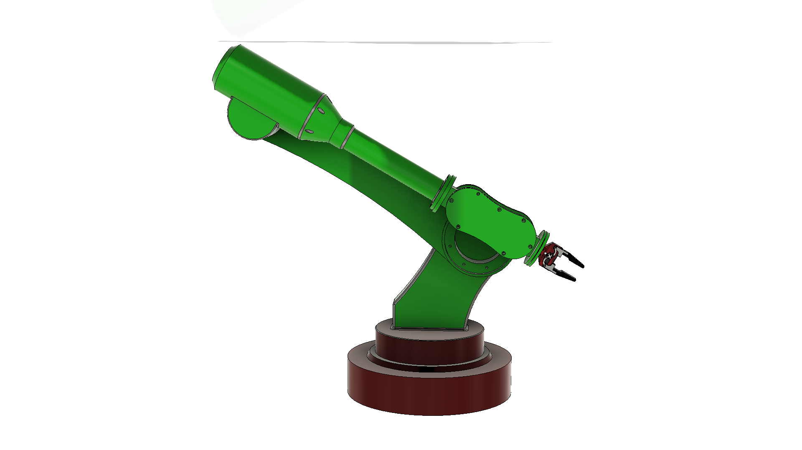

# Assem1 — Robot Description



## Overview

| Property | Value |
|----------|-------|
| Total mass | 975.374 kg |
| Links | 12 |
| Joints | 11 (10 movable) |
| Assemblies | 2 |
| Root link | `base_link` |

## Table of Contents

- [Kinematic Tree](#kinematic-tree)
- [Link Properties](#link-properties)
- [Joint Properties](#joint-properties)
- [Assembly Breakdown](#assembly-breakdown)
- [Quick Start (ROS 2)](#quick-start-ros-2)
- [Files](#files)

## Kinematic Tree

```
base_link
  └─ Revolute_1 [continuous]
    Base0
      └─ Revolute_2 [continuous]
        Arm01 [BAKE]
          └─ Revolute3 [continuous]
            Arm02 [BAKE]
              └─ Revolute4 [continuous]
                for_arm_group [BAKE]
                  └─ Revolute6 [revolute]
                    Part02 [BAKE]
                      └─ griper_joint [fixed]
                        led_base
                          └─ servo_joint [revolute]
                            servo_mount [BAKE]
                              └─ left_pivot_joint2 [continuous]
                                right_pivot [BAKE]
                                  └─ left_pivot_joint1 [continuous]
                                    acc_right_gripper [BAKE]
                              └─ right_pivot_joint2 [continuous]
                                left_pivot [BAKE]
                                  └─ right_pivot_joint1 [continuous]
                                    acc_left_gripper [BAKE]
```

## Link Properties

| Link | Mass (kg) | Material | Collision | Bodies |
|------|-----------|----------|-----------|--------|
| `Arm01` | 68.9944 | Steel | convex_hull | 1 |
| `Arm02` | 122.5916 | Steel | convex_hull | 3 |
| `Base0` | 239.6958 | Steel | convex_hull | 1 |
| `Part02` | 8.2770 | Steel | convex_hull | 1 |
| `acc_left_gripper` | 0.0531 | Generico | convex_hull | 1 |
| `acc_right_gripper` | 0.0531 | Generico | convex_hull | 1 |
| `base_link` | 458.5186 | Steel | convex_hull | 1 |
| `for_arm_group` | 76.8663 | Steel | convex_hull | 1 |
| `led_base` | 0.3037 | Steel | convex_hull | 3 |
| `left_pivot` | 0.0039 | Generico | convex_hull | 1 |
| `right_pivot` | 0.0039 | Generico | convex_hull | 1 |
| `servo_mount` | 0.0121 | material | convex_hull | 1 |

## Joint Properties

| Joint | Type | Parent → Child | Axis | Limits |
|-------|------|---------------|------|--------|
| `Revolute3` | continuous | `Arm01` → `Arm02` | (-0,-0,1) | — |
| `Revolute4` | continuous | `Arm02` → `for_arm_group` | (-1,0,0) | — |
| `Revolute6` | revolute | `for_arm_group` → `Part02` | (-0,0,1) | [-100.0°, 100.0°] |
| `Revolute_1` | continuous | `base_link` → `Base0` | (-0,1,-0) | — |
| `Revolute_2` | continuous | `Base0` → `Arm01` | (1,0,0) | — |
| `griper_joint` | fixed | `Part02` → `led_base` | (0,0,1) | — |
| `left_pivot_joint1` | continuous | `right_pivot` → `acc_right_gripper` | (-0,0,-1) | — |
| `left_pivot_joint2` | continuous | `servo_mount` → `right_pivot` | (-0,-0,1) | — |
| `right_pivot_joint1` | continuous | `left_pivot` → `acc_left_gripper` | (0,0,1) | — |
| `right_pivot_joint2` | continuous | `servo_mount` → `left_pivot` | (0,0,1) | — |
| `servo_joint` | revolute | `led_base` → `servo_mount` | (0,1,0) | [-58.0°, 0.0°] |

## Assembly Breakdown

### Assem1

- **Links**: Part02, base_link, Arm01, Base0, Arm02, for_arm_group
- **Total mass**: 974.944 kg

### griper

- **Links**: left_pivot, led_base, servo_mount, acc_left_gripper, acc_right_gripper, right_pivot
- **Total mass**: 0.430 kg

## Quick Start (ROS 2)

```bash
# 1. Copy package to your ROS 2 workspace
cp -r Assem1_description ~/ros2_ws/src/

# 2. Build
cd ~/ros2_ws
colcon build --packages-select Assem1_description
source install/setup.bash

# 3. Visualize in RViz2
ros2 launch Assem1_description display.launch.py

# 4. Validate URDF structure
check_urdf install/Assem1_description/share/Assem1_description/urdf/Assem1.urdf

# 5. Print kinematic tree
urdf_to_graphviz install/Assem1_description/share/Assem1_description/urdf/Assem1.urdf
```

**Joint control**: The launch file includes `joint_state_publisher_gui` —
use the sliders to move revolute/prismatic joints in RViz2.

**Topic inspection**:
```bash
# See published joint states
ros2 topic echo /joint_states

# See robot description parameter
ros2 param get /robot_state_publisher robot_description
```

## Files

| Path | Description |
|------|-------------|
| `urdf/Assem1.urdf.xacro` | Top-level xacro (entry point) |
| `urdf/Assem1.urdf` | Flat URDF (for validation) |
| `urdf/assemblies/` | Per-assembly xacro macros |
| `meshes/` | Visual (OBJ) and collision (STL) meshes |
| `launch/display.launch.py` | Launch robot_state_publisher, RViz, and generated controllers |
| `config/joint_state.yaml` | Joint state publisher config |
| `config/ros2_controllers.yaml` | Generated ros2_control controller manager config |
| `robot_data.yaml` | Supplementary data (beyond URDF) |
| `docs/transforms.md` | Transformation matrices (KaTeX) |

## Customizing

Assemblies tagged `!dummy_` are designed to be swapped out. To replace one:

1. Create your replacement as a xacro macro with the same interface
2. Place it in `urdf/assemblies/`
3. Update the `<xacro:include>` in `urdf/Assem1.urdf.xacro`
4. Update meshes in `meshes/<your_assembly>/`

The xacro prefix system (`${prefix}`) ensures link names stay unique
when multiple instances of the same assembly are used.

---
*Generated by Fusion URDF/XACRO Exporter v3.0.0*