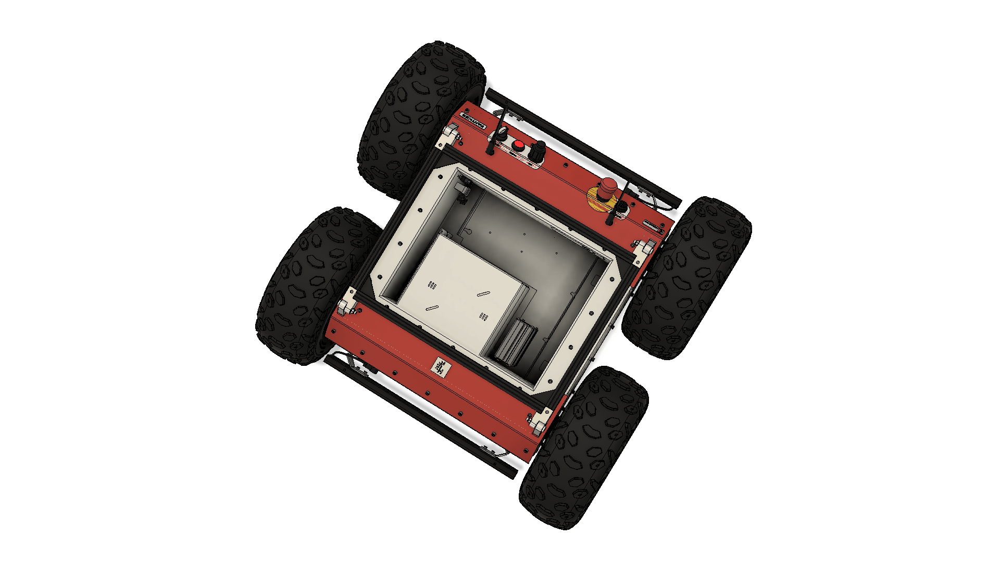

# Panther — Robot Description



## Overview

| Property | Value |
|----------|-------|
| Total mass | 147.019 kg |
| Links | 17 |
| Joints | 16 (4 movable) |
| Assemblies | 5 |
| Root link | `base_link` |

## Table of Contents

- [Kinematic Tree](#kinematic-tree)
- [Link Properties](#link-properties)
- [Joint Properties](#joint-properties)
- [Assembly Breakdown](#assembly-breakdown)
- [Quick Start (ROS 2)](#quick-start-ros-2)
- [Files](#files)

## Kinematic Tree

```
base_link
  └─ fr_wheel_base_joint [fixed]
    fr_wheel_base_link [EMPTY]
      └─ fr_wheel_joint [continuous]
        fr_wheel_link
  └─ fl_wheel_base_joint [fixed]
    fl_wheel_base_link [EMPTY]
      └─ fl_wheel_joint [continuous]
        fl_wheel_link
  └─ rr_wheel_base_joint [fixed]
    rr_wheel_base_link [EMPTY]
      └─ rr_wheel_joint [continuous]
        rr_wheel_link
  └─ rl_wheel_base_joint [fixed]
    rl_wheel_base_link [EMPTY]
      └─ rl_wheel_joint [continuous]
        rl_wheel_link
  └─ body_to_cover_joint [fixed]
    cover_link [EMPTY]
      └─ cover_to_mount_joint [fixed]
        mount_link [EMPTY]
  └─ body_to_imu_joint [fixed]
    imu_link [EMPTY]
  └─ body_to_footprint_joint [fixed]
    base_footprint [EMPTY]
  └─ body_to_front_bumper_joint [fixed]
    front_bumper_link [EMPTY]
      └─ front_bumper_to_lights_channel_1_joint [fixed]
        lights_channel_1_link [EMPTY]
  └─ body_to_rear_bumper_joint [fixed]
    rear_bumper_link [EMPTY]
      └─ rear_bumper_to_lights_channel_2_joint [fixed]
        lights_channel_2_link [EMPTY]
```

## Link Properties

| Link | Mass (kg) | Material | Collision | Bodies |
|------|-----------|----------|-----------|--------|
| `base_footprint` | 0.0000 | — | empty | 0 |
| `base_link` | 136.2521 | — | convex_hull | 0 |
| `cover_link` | 0.0000 | — | empty | 0 |
| `fl_wheel_base_link` | 0.0000 | — | empty | 0 |
| `fl_wheel_link` | 2.6918 | — | convex_hull | 0 |
| `fr_wheel_base_link` | 0.0000 | — | empty | 0 |
| `fr_wheel_link` | 2.6918 | — | convex_hull | 0 |
| `front_bumper_link` | 0.0000 | — | empty | 0 |
| `imu_link` | 0.0000 | — | empty | 0 |
| `lights_channel_1_link` | 0.0000 | — | empty | 0 |
| `lights_channel_2_link` | 0.0000 | — | empty | 0 |
| `mount_link` | 0.0000 | — | empty | 0 |
| `rear_bumper_link` | 0.0000 | — | empty | 0 |
| `rl_wheel_base_link` | 0.0000 | — | empty | 0 |
| `rl_wheel_link` | 2.6918 | — | convex_hull | 0 |
| `rr_wheel_base_link` | 0.0000 | — | empty | 0 |
| `rr_wheel_link` | 2.6918 | — | convex_hull | 0 |

## Joint Properties

| Joint | Type | Parent → Child | Axis | Limits |
|-------|------|---------------|------|--------|
| `body_to_cover_joint` | fixed | `base_link` → `cover_link` | (0,0,1) | — |
| `body_to_footprint_joint` | fixed | `base_link` → `base_footprint` | (0,0,1) | — |
| `body_to_front_bumper_joint` | fixed | `base_link` → `front_bumper_link` | (0,0,1) | — |
| `body_to_imu_joint` | fixed | `base_link` → `imu_link` | (0,0,1) | — |
| `body_to_rear_bumper_joint` | fixed | `base_link` → `rear_bumper_link` | (0,0,1) | — |
| `cover_to_mount_joint` | fixed | `cover_link` → `mount_link` | (0,0,1) | — |
| `fl_wheel_base_joint` | fixed | `base_link` → `fl_wheel_base_link` | (0,0,1) | — |
| `fl_wheel_joint` | continuous | `fl_wheel_base_link` → `fl_wheel_link` | (0,-1,0) | — |
| `fr_wheel_base_joint` | fixed | `base_link` → `fr_wheel_base_link` | (0,0,1) | — |
| `fr_wheel_joint` | continuous | `fr_wheel_base_link` → `fr_wheel_link` | (-0,-1,-0) | — |
| `front_bumper_to_lights_channel_1_joint` | fixed | `front_bumper_link` → `lights_channel_1_link` | (0,0,1) | — |
| `rear_bumper_to_lights_channel_2_joint` | fixed | `rear_bumper_link` → `lights_channel_2_link` | (0,0,1) | — |
| `rl_wheel_base_joint` | fixed | `base_link` → `rl_wheel_base_link` | (0,0,1) | — |
| `rl_wheel_joint` | continuous | `rl_wheel_base_link` → `rl_wheel_link` | (0,-1,0) | — |
| `rr_wheel_base_joint` | fixed | `base_link` → `rr_wheel_base_link` | (0,0,1) | — |
| `rr_wheel_joint` | continuous | `rr_wheel_base_link` → `rr_wheel_link` | (0,-1,0) | — |

## Assembly Breakdown

### Communication_Panel

- **Links**: 
- **Total mass**: 0.000 kg

### Fusalage

- **Links**: 
- **Total mass**: 0.000 kg

### Internal_components

- **Links**: 
- **Total mass**: 0.000 kg

### User_Safety_Interface

- **Links**: 
- **Total mass**: 0.000 kg

### panther

- **Links**: base_link, cover_link, mount_link, fr_wheel_base_link, fl_wheel_base_link, rl_wheel_base_link, rr_wheel_base_link, imu_link, base_footprint, front_bumper_link, rear_bumper_link, lights_channel_2_link, lights_channel_1_link, fl_wheel_link, fr_wheel_link, rr_wheel_link, rl_wheel_link
- **Total mass**: 147.019 kg

## Quick Start (ROS 2)

```bash
# 1. Copy package to your ROS 2 workspace
cp -r Panther_description ~/ros2_ws/src/

# 2. Build
cd ~/ros2_ws
colcon build --packages-select Panther_description
source install/setup.bash

# 3. Visualize in RViz2
ros2 launch Panther_description display.launch.py

# 4. Validate URDF structure
check_urdf install/Panther_description/share/Panther_description/urdf/Panther.urdf

# 5. Print kinematic tree
urdf_to_graphviz install/Panther_description/share/Panther_description/urdf/Panther.urdf
```

**Joint control**: The launch file includes `joint_state_publisher_gui` —
use the sliders to move revolute/prismatic joints in RViz2.

**Topic inspection**:
```bash
# See published joint states
ros2 topic echo /joint_states

# See robot description parameter
ros2 param get /robot_state_publisher robot_description
```

## Files

| Path | Description |
|------|-------------|
| `urdf/Panther.urdf.xacro` | Top-level xacro (entry point) |
| `urdf/Panther.urdf` | Flat URDF (for validation) |
| `urdf/assemblies/` | Per-assembly xacro macros |
| `meshes/` | Visual (OBJ) and collision (STL) meshes |
| `launch/display.launch.py` | Launch robot_state_publisher, RViz, and generated controllers |
| `config/joint_state.yaml` | Joint state publisher config |
| `config/ros2_controllers.yaml` | Generated ros2_control controller manager config |
| `robot_data.yaml` | Supplementary data (beyond URDF) |
| `docs/transforms.md` | Transformation matrices (KaTeX) |

## Customizing

Assemblies tagged `!dummy_` are designed to be swapped out. To replace one:

1. Create your replacement as a xacro macro with the same interface
2. Place it in `urdf/assemblies/`
3. Update the `<xacro:include>` in `urdf/Panther.urdf.xacro`
4. Update meshes in `meshes/<your_assembly>/`

The xacro prefix system (`${prefix}`) ensures link names stay unique
when multiple instances of the same assembly are used.

---
*Generated by Fusion URDF/XACRO Exporter v3.0.0*